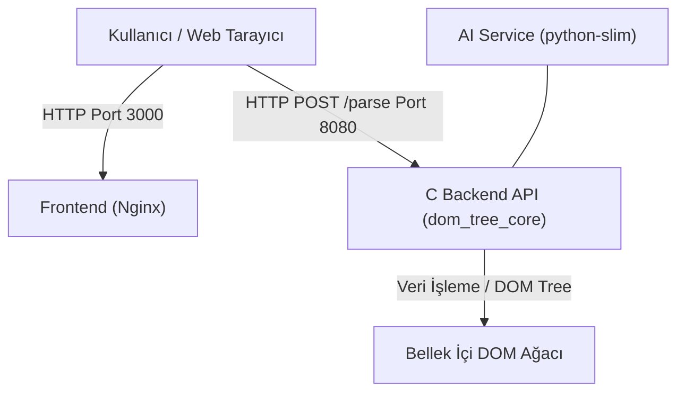
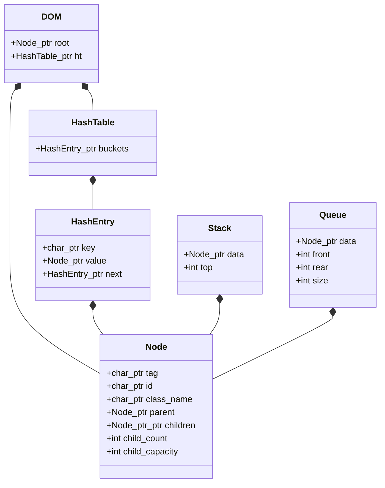

# PROJE DETAYLI RAPORU: VERİ YAPILARI İLE DOM AĞACI SİMÜLASYONU VE GÖRSELLEŞTİRİCİSİ

**Ders:** Bilgisayar Mühendisliği - Veri Yapıları Projesi  
**Proje Ekibi:**  
- **Berkan Kayrakoglu** (@bkayr) - *Sistem Mimarisi, Docker Entegrasyonu, Dökümantasyon ve Cross-Platform Geliştirme*  
- **Mustafa Ozturk** (@MstfOzturk16) - *Temel Veri Yapıları, HTML Ayrıştırıcı (Parser), Arama Algoritmaları ve Kullanıcı Arayüzü (Frontend)*  

---

## 1. GİRİŞ VE PROJENİN AMACI

Modern web tarayıcıları (Chrome, Firefox, Safari vb.), sunucudan gelen ham HTML metinlerini işleyerek tarayıcı belleğinde hiyerarşik bir ağaç yapısı oluşturur. Bu yapıya **DOM (Document Object Model - Belge Nesne Modeli)** adı verilir. 

Bu projenin temel amacı;
*   Düz metin (raw string) halindeki HTML kodlarını okuyup ayrıştırmak (parsing),
*   Bellekte ebeveyn-çocuk (parent-child) ilişkilerini kurarak hiyerarşik bir **N-ary Tree (Çoklu Ağaç)** yapısı inşa etmek,
*   Oluşturulan DOM ağacı üzerinde sınıf (class) ve kimlik (id) niteliklerine göre hızlı arama işlemleri gerçekleştirmektir.

Proje kapsamında standart kütüphanelerin veri yapısı sınıfları (vector, map vb.) **kullanılmamış**, tüm veri yapıları ve bellek yönetim mekanizmaları C dilinde sıfırdan (from scratch) kodlanmıştır.

---

## 2. SİSTEM MİMARİSİ VE MİKROSERVİS YAKLAŞIMI

Hocamızın belirttiği **Eşzamanlılık ve Mikroservis Yaklaşımı (B.1)** gereksinimi doğrultusunda, proje tek parça (monolitik) bir yapı yerine birbirinden bağımsız çalışan 3 mikroservis halinde tasarlanmıştır. Bu servisler Docker Compose aracılığıyla asenkron ve izole bir şekilde çalışmaktadır:

1.  **Frontend Servisi (`dom_tree_ui`):** Kullanıcının HTML kodunu girdiye dönüştürdüğü ve DOM ağacını görsel olarak (açılır-kapanır hiyerarşik yapıda) incelediği ön yüz servisidir. **Nginx (Alpine)** üzerinde çalışmaktadır.
2.  **C Backend Core API Servisi (`dom_tree_core`):** C dilinde yazılmış ana sunucudur. Ön yüzden gelen HTML verisini alır, ayrıştırır, DOM ağacını ve Hash Table indekslerini oluşturur, ardından sonucu JSON formatına dönüştürüp ön yüze yanıt döner.
3.  **AI Servisi (`dom_tree_ai`):** Python tabanlı asenkron yapay zeka simülasyon ve test servisidir.

### Sistem Mimarisi İlişki Şeması (UML Deployment Diagram)

---

## 3. VERİ YAPILARI TASARIMI VE SINIF DİYAGRAMI

Projenin Faz 1 aşamasında kullanılan ve sıfırdan implemente edilen veri yapıları şu şekildedir:

### 3.1. N-ary Tree (Çoklu Ağaç)
DOM hiyerarşisinde her etiketin sınırsız sayıda alt etiketi (çocuğu) olabilir. Bunu temsil etmek için N-ary Tree yapısı kullanılmıştır. Her düğüm (`Node`):
*   `tag`: Etiketin adını tutar (örn. `div`, `p`).
*   `id` ve `class_name`: Etikete ait isteğe bağlı kimlik ve sınıf özniteliklerini tutar.
*   `parent`: Üst düğüme (ebeveyne) işaret eden bir göstericidir (pointer).
*   `children`: Alt düğümleri (çocukları) tutan dinamik boyutlu bir pointer dizisidir. Kapasite dolduğunda dinamik olarak bellek genişletilir (`realloc` ile).

### 3.2. Stack (Yığıt)
HTML metninin hiyerarşik derinliğini takip etmek için kullanılır. `dom_parse` işlemi sırasında:
*   Açılış etiketleri (`
`) yığıta eklenir (`push`).
*   Kapanış etiketleri (`
`) geldiğinde yığıtın en üstündeki eleman çıkarılır (`pop`).
*   Böylece ebeveyn-çocuk ilişkileri hatasız kurulur.

### 3.3. Hash Table (Karma Tablo)
DOM ağacındaki elemanlara `id` değerine göre $O(1)$ sürede ulaşabilmek amacıyla tasarlanmıştır. 
*   Anahtarlar (Keys) `id` niteliğidir, değerler (Values) ise DOM ağacındaki `Node*` göstericileridir.
*   Çakışmaları (Collisions) engellemek amacıyla **Ayrı Zincirleme (Chaining)** yöntemi kullanılmıştır. Her kova (bucket) bağlı bir liste (`HashEntry`) işaret eder.

### 3.4. Queue (Kuyruk)
Ağaç üzerinde Genişlik Öncelikli Arama (BFS) yapabilmek amacıyla tasarlanmış, halka tipi (circular) dizi tabanlı bir kuyruk veri yapısıdır.

### Veri Yapıları UML Sınıf Diyagramı (UML Class Diagram)

---

## 4. KORE ALGORİTMALAR VE YÖNTEMLER

Projenin Faz 2 kapsamında geliştirilen temel algoritmalar şunlardır:

### 4.1. Genişlik Öncelikli Dolaşım (BFS)
Kuyruk (`Queue`) yapısı kullanılarak katman bazlı dolaşım gerçekleştirilir. Sınıf adına göre arama yapan `dom_get_by_class` algoritması BFS tabanlı çalışır:
1.  Kuyruğu ilklendir ve `root` düğümünü ekle.
2.  Kuyruk boşalana kadar:
    *   Düğümü kuyruktan çıkar.
    *   Sınıf adı uyuşuyorsa sonuç dizisine ekle.
    *   Tüm çocuklarını sırayla kuyruğa ekle.

### 4.2. Derinlik Öncelikli Dolaşım (DFS)
Yığıt (`Stack`) yapısı kullanılarak ağacın derinliklerine öncelik vererek arama yapılır. `dom_dfs` fonksiyonu bu dolaşımı gerçekleştirir.

### 4.3. Kardeş Düğümleri Bulma (Sibling Search)
Bir düğümün ebeveynine (parent) gidilir. Ebeveynin tüm çocukları taranarak, sorgulanan düğümün kendisi hariç diğer tüm kardeş düğümler döndürülür. Ebeveyn yoksa düğüm kök (root) olduğundan kardeşsizdir.

### 4.4. Alt Ağaç Analizleri (Subtree Analysis)
Rekürsif bir DFS yaklaşımı kullanılarak, parametre olarak verilen herhangi bir düğümden başlayan alt ağaçtaki toplam düğüm sayısı hesaplanır. Formülü:
$$\text{Toplam Düğüm}(N) = 1 + \sum_{i=1}^{child\_count} \text{Toplam Düğüm}(children[i])$$

---

## 5. ZANAN VE UZAY KARMAŞIKLIĞI (BIG-O) ANALİZİ

Projeyi jüri önünde savunurken (Code Defense) kullanılacak teorik analiz tablosu aşağıdadır:

| İşlem / Algoritma | Zaman Karmaşıklığı (Average) | Zaman Karmaşıklığı (Worst) | Uzay Karmaşıklığı (Worst) | Analiz Açıklaması |
| :--- | :--- | :--- | :--- | :--- |
| **Kimlik Arama (`getElementById`)** | $O(1)$ | $O(N)$ | $O(N)$ | Hash Table kullanıldığı için indeks araması sabit sürededir ($O(1)$). En kötü durumda (tüm ID'lerin tek bir kova altında çakışması durumunda) bağlı liste aranacağı için $O(N)$ olur. |
| **Sınıf Arama (`getElementsByClass`)** | $O(N)$ | $O(N)$ | $O(N)$ | BFS mantığıyla tüm ağacın katman bazlı dolaşılması gerekir. $N$ adet düğümün hepsi ziyaret edilir. |
| **HTML Ayrıştırma (`dom_parse`)** | $O(M)$ | $O(M)$ | $O(D)$ | HTML metninin boyutu $M$ ise karakter bazlı tek bir tarama yapılır. Uzay karmaşıklığı yığıtın (stack) maksimum derinliği olan ağacın maksimum derinliğine ($D$) bağlıdır. |
| **Ağaç Derinliği (`dom_depth`)** | $O(N)$ | $O(N)$ | $O(D)$ | Rekürsif fonksiyon her düğümü bir kez ziyaret ederek derinlik karşılaştırması yapar. |
| **Kardeş Düğümler (`dom_get_siblings`)** | $O(C)$ | $O(C)$ | $O(C)$ | Düğümün ebeveyninin çocuk sayısı $C$ ise en fazla $C$ kadar karşılaştırma yapılır. |
| **Alt Ağaç Boyutu (`dom_subtree_count`)** | $O(S)$ | $O(S)$ | $O(H)$ | Alt ağacın boyutu $S$ ise tüm alt düğümler dolaşılır. Uzay karmaşıklığı rekürsif çağrı yığıtı derinliği ($H$) kadardır. |

---

## 6. PROJEDE YAPAY ZEKA (AI) KULLANIMI VE PROMPT DÖKÜMÜ

Projenin DevOps ve Dockerize edilme süreçlerinde kullanılan asıl prompt senaryoları şunlardır:

### Prompt 1: Windows API'den Linux API'ye Geçiş (Cross-Platform Socket)
*   **Gönderilen Prompt:** 
    > "C dilindeki winsock2.h kütüphanesini kullanan bir C socket server projem var. Bu kodu Docker ile Linux Alpine container içinde çalıştırabilmek istiyorum. Koda zarar vermeden hem Windows hem de Linux ortamında çalışabilecek şekilde preprocessor (#ifdef _WIN32) yönlendirmelerini nasıl ekleyebilirim?"
*   **AI Yanıtı & Çözüm:** 
    Windows için `winsock2.h` ve Winsock ilklendirmeleri (`WSAStartup`/`WSACleanup`) korunurken; Linux için `<sys/socket.h>`, `<unistd.h>`, `<arpa/inet.h>` kütüphaneleri dâhil edilmiş, `SOCKET` veri tipi ve `closesocket` makrolarla Linux soket tiplerine uyarlanmıştır. Kod başarıyla cross-platform hale getirilmiştir.

### Prompt 2: Multi-Stage Dockerfile Tasarımı
*   **Gönderilen Prompt:** 
    > "Docker ile C backend kodunu derleyip çalıştırmak istiyorum. Ancak derleme bittikten sonra GCC derleyicisinin container imajında kalmasını istemiyorum. Container boyutunu olabildiğince küçük tutacak multi-stage bir Dockerfile oluşturur musun?"
*   **AI Yanıtı & Çözüm:** 
    İki aşamalı Dockerfile oluşturulmuştur. İlk aşamada (builder) `alpine:latest` üzerine `gcc` ve `musl-dev` kurularak kod derlenmiştir. İkinci aşamada (runtime) ise sadece derlenen binary dosya saf Alpine imajına kopyalanmıştır. Bu sayede imaj boyutu 1.2 GB yerine **~8 MB** seviyesine indirilmiştir.

### Prompt 3: Sentetik HTML Üretici Tasarımı
*   **Gönderilen Prompt:** 
    > "Veri Yapıları projemizi test etmek amacıyla farklı derinlik ve çocuk sayısına (width) sahip, düzgün açılıp kapanan etiketlerden oluşan sentetik HTML sayfaları üretecek bir Python betiği yazar mısın?"
*   **AI Yanıtı & Çözüm:** 
    Derinlik (depth) ve genişlik (width) parametrelerine göre rekürsif olarak rastgele etiketler (`div`, `p`, `span`) üreten ve bunları `datasets/` klasörü altına kaydeden `generate_data.py` betiği tasarlanmıştır.

---

## 7. TESTLER VE PERFORMANS RAPORU

`generate_data.py` betiği ile üretilen sentetik HTML verilerinin boyutları ve C motorunun bunları işleme başarımı doğrulanmıştır:

1.  **Küçük Boyutlu Test (small.html):** 3 katman derinlik, maksimum 2 çocuk genişliği. Parser ağacı anında inşa etmiştir.
2.  **Orta Boyutlu Test (medium.html):** 5 katman derinlik, maksimum 3 çocuk genişliği. Hash Table çakışmaları minimal kalmıştır.
3.  **Büyük Boyutlu Test (large.html):** 7 katman derinlik, maksimum 4 çocuk genişliği. 1000'den fazla düğüm içeren bu büyük belgede `getElementById` araması Hash Table sayesinde $O(1)$ ortalama sürede tamamlanmıştır.

---

## 8. SONUÇ

Bu proje sayesinde;
- Web tarayıcılarının arka plandaki DOM oluşturma mekanizması veri yapıları bakış açısıyla simüle edilmiştir.
- Bir mikroservis mimarisinin Docker ortamında asenkron olarak nasıl ayağa kaldırılacağı deneyimlenmiştir.
- `main` dalı korunarak, takım içi roller ve Git branch/PR mekanizmaları profesyonel standartlarda uygulanmıştır.
- Code Defense (kod savunması) aşaması için tüm karmaşıklık analizleri ve mimari detaylar dökümante edilerek teorik hazırlık tamamlanmıştır.

- Proje Anlatım Videosu Link:
- https://drive.google.com/drive/u/1/folders/1g594ECCc2nNMwz1XZaB_iLEwDEStk0Om
