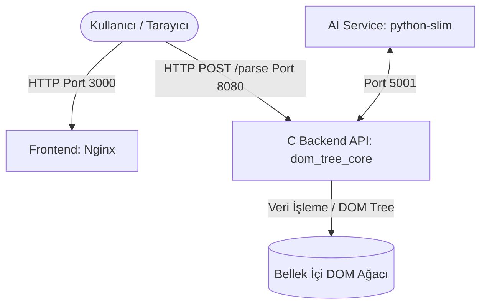
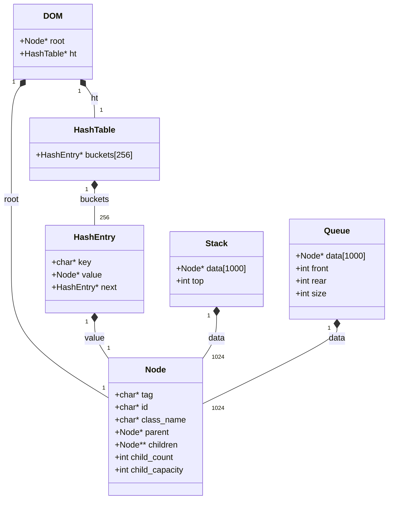

# Proje Raporu: DOM Ağacı Görselleştirici

Bu rapor, projenin veri yapıları tasarımı, sistem mimarisi, zaman karmaşıklığı (Big-O) analizi ve kullanılan yöntemleri içermektedir.

---

## 1. Sistem Mimarisi ve UML Diyagramları

### Sistem Mimarisi (Mermaid)

Sistem, Docker Compose üzerinde 3 bağımsız servis olarak koordine edilmektedir:

### Sınıf / Veri Yapıları Diyagramı (UML Class Diagram)

Projede sıfırdan implemente edilen veri yapılarının ilişkileri aşağıdaki gibidir:

---

## 2. Veri Yapılarının Big-O Zaman Karmaşıklığı Analizi

Projedeki algoritmaların zaman karmaşıklığı analizleri aşağıdaki gibidir:

| Fonksiyon / İşlem | Veri Yapısı / Yöntem | Ortalama Durum (Average Case) | En Kötü Durum (Worst Case) | Açıklama |
| :--- | :--- | :--- | :--- | :--- |
| **getElementById** | Hash Table | $O(1)$ | $O(N)$ | ID değerleri Hash Table'da indekslendiği için arama ortalama $O(1)$ sürer. En kötü durumda tüm ID'ler aynı buckete düşerse (hash collision) $O(N)$ olur. |
| **getElementsByClass** | Queue (BFS) | $O(N)$ | $O(N)$ | Sınıf adına göre arama yapmak için tüm ağacı Genişlik Öncelikli (BFS) dolaşmamız gerekir. Bu yüzden $O(N)$'dir. |
| **dom_parse (Parsing)** | Stack | $O(M)$ | $O(M)$ | HTML metnini baştan sona bir kez karakter taraması (linear scan) yaparak işlediğimiz için metin uzunluğu $M$ ile doğru orantılıdır. |
| **dom_depth (Derinlik)** | Rekürsif Traversal | $O(N)$ | $O(N)$ | Ağacın en derin dalını bulmak için tüm düğümleri ziyaret etmemiz gerekir. |
| **dom_get_siblings (Kardeşler)** | Pointer Kontrolü | $O(C)$ | $O(C)$ | Düğümün ebeveyninin (parent) çocuk sayısına ($C$) bağlı olarak tarama yapar. |
| **dom_subtree_node_count** | Rekürsif DFS | $O(S)$ | $O(S)$ | İlgili alt ağacın boyutu ($S$) kadar düğümü ziyaret eder. |

---

## 3. AI API Prompt Dökümü

Projeyi geliştirirken yapay zekadan (GenAI) yararlanılan temel kısımlar ve kullanılan prompt örnekleri:

1. **Cross-Platform Sunucu Dönüşümü:**
   - *Prompt:* "C dilindeki winsock2.h tabanlı bir HTTP soket sunucusunu hem Windows'ta hem de Linux (Docker Alpine) üzerinde sorunsuz derlenebilecek şekilde cross-platform hale getirmek için #ifdef makrolarını nasıl kullanabilirim?"
2. **Multi-Stage Dockerfile Optimizasyonu:**
   - *Prompt:* "Alpine imajı kullanarak C kodunu derleyen ve runtime aşamasında gcc bağımlılığı olmadan sunucuyu çalıştıran multi-stage bir Dockerfile hazırlar mısın? Boyutun en küçük olması gerekiyor."
3. **Sentetik Veri Üretimi:**
   - *Prompt:* "DOM parser testleri için python kullanarak rastgele derinlik ve genişlikte, valid açılıp kapanan taglere sahip iç içe geçmiş sentetik HTML kodları üreten bir script hazırlar mısın?"
